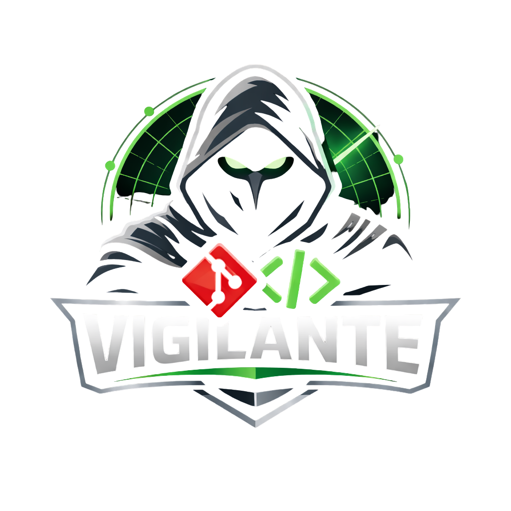

<p align="center">
  
</p>

# vigilante

[](https://github.com/aliengiraffe/vigilante/releases/latest)
[](https://goreportcard.com/report/github.com/nicobistolfi/vigilante)
[](https://pkg.go.dev/search?q=github.com%2Fnicobistolfi%2Fvigilante)
[](https://github.com/aliengiraffe/vigilante/blob/main/LICENSE)
[](https://github.com/aliengiraffe/vigilante/actions/workflows/release.yml)

`vigilante` is a sandbox-first orchestration layer for coding agents.

Treat the model as untrusted by default. Vigilante is the control plane that turns GitHub issues into a guarded issue-to-PR pipeline: one git worktree per task, deterministic lifecycle management, scoped execution, and a durable operator trail through issue comments, session state, and pull requests.

It is not the model itself. Vigilante schedules work, prepares isolated worktrees, launches a supported coding-agent CLI, tracks progress, and recovers or cleans up stalled sessions so a repository behaves like a controlled worker instead of a loose collection of scripts.

[Docs](DOCS.md) · [Sandbox Design](SANDBOX.md) · [Closed Issues](https://github.com/aliengiraffe/vigilante/issues?q=is%3Aissue%20state%3Aclosed) · [Releases](https://github.com/aliengiraffe/vigilante/releases) · [Contributing](CONTRIBUTING.md)

## Why Vigilante Exists

Coding agents need broad tool access to be useful. That also means they can read the wrong files, use the wrong credentials, or leave behind hard-to-audit state if you run them with ambient access.

Vigilante reduces that risk by making the orchestrator responsible for enforcement:

- one isolated git worktree per issue
- issue-driven execution with progress reported back to GitHub
- repository-aware implementation skills selected from local context
- local session tracking for cleanup, resume, redispatch, and recovery
- optional package-hardening checks for supported Node.js repositories

## How It Works

Vigilante keeps the flow short and explicit:

1. Watch a local repository tied to a GitHub remote.
2. Read open issues and select only eligible work.
3. Create a fresh git worktree and issue branch.
4. Launch a supported coding-agent CLI in that worktree.
5. Track progress through issue comments, local session state, and PR status.
6. Clean up or recover the run without duplicating work.

GitHub is the only fully implemented issue-tracking backend today. The backend interfaces are designed so support for systems such as Linear and Jira can be added without rewriting the orchestration loop.

## Guardrails That Matter

- **Worktree isolation.** Every issue gets its own branch and worktree so the main checkout stays untouched.
- **Operator-visible lifecycle.** Start, progress, failure, and PR state are reflected through GitHub comments and local Vigilante state.
- **Provider-neutral orchestration.** Works with supported headless coding-agent CLIs including `codex`, `claude`, and `gemini`.
- **Recovery tooling.** `resume`, `redispatch`, and `cleanup` are first-class flows, not ad hoc scripts.
- **Rate-limit awareness.** Vigilante monitors GitHub API budget and delays additional work when quota gets tight.

## Sandbox Positioning

Vigilante already isolates work at the git-worktree layer today. `SANDBOX.md` describes the next isolation layer: running each coding-agent session inside a repo-scoped Docker container with proxy-mediated GitHub access and short-lived credentials.

In other words:

- **Current state:** isolated worktrees, local session tracking, host-executed agent CLI
- **Planned sandbox mode:** containerized execution, stronger credential scoping, repo-bounded GitHub proxying

See [SANDBOX.md](SANDBOX.md) for the design and current status.

## Install

Install with Homebrew:

```sh
brew install vigilante
```

Requirements:

- `git`
- `gh` authenticated against the GitHub account Vigilante should operate with
- one supported coding-agent CLI installed locally: `codex`, `claude`, or `gemini`

Bootstrap the local machine and install the managed service:

```sh
vigilante setup -d --provider codex
```

## Quick Start

Register a repository and let Vigilante manage the issue-to-PR loop:

```sh
vigilante watch ~/path/to/repo
```

Typical first-run flow:

```sh
brew install vigilante
vigilante setup -d --provider codex
vigilante watch ~/hello-world-app
vigilante daemon run --once
```

Useful follow-up commands:

```sh
vigilante list
vigilante list --running
vigilante status
vigilante logs
vigilante service restart
```

## Key Commands

- `vigilante setup`: verify dependencies, install bundled skills, and install or refresh the managed service
- `vigilante watch <path>`: register a local repository for issue monitoring
- `vigilante clone <repo> [<path>]`: clone a repository and auto-add it to the watch list
- `vigilante list`: show watched repositories and optionally active runs
- `vigilante status`: show service health, watched repos, sessions, and rate-limit state
- `vigilante logs`: inspect daemon and per-issue logs
- `vigilante resume`, `vigilante redispatch`, `vigilante cleanup`: recover or restart stuck work safely
- `vigilante daemon run`: run the watcher loop in the foreground

## Additional Capabilities

### Fork Mode

Use fork mode when the authenticated GitHub identity should open pull requests from a fork instead of pushing issue branches directly to the upstream watched repository.

```sh
vigilante watch --fork ~/hello-world-app
```

Use `--fork-owner` with `--fork` when the fork should live under a bot or organization account. For the full behavior, see [DOCS.md](DOCS.md).

### Package Hardening

Vigilante includes a deterministic package-hardening scan for watched repositories classified with the `nodejs` tech stack. It checks lockfile presence, audits npm dependencies when applicable, and reviews CI install posture without relying on an LLM.

For trigger conditions, findings, and remediation flow, see [DOCS.md](DOCS.md#package-hardening).

## More Docs

The full reference lives in [DOCS.md](DOCS.md), including:

- installation details and development mode
- full command reference and expected behaviors
- backend architecture and current implementation status
- local state layout, logs, and recovery workflows
- package hardening behavior and config
- GitHub integration, worktree strategy, and service behavior
- CI, releases, and implementation notes
