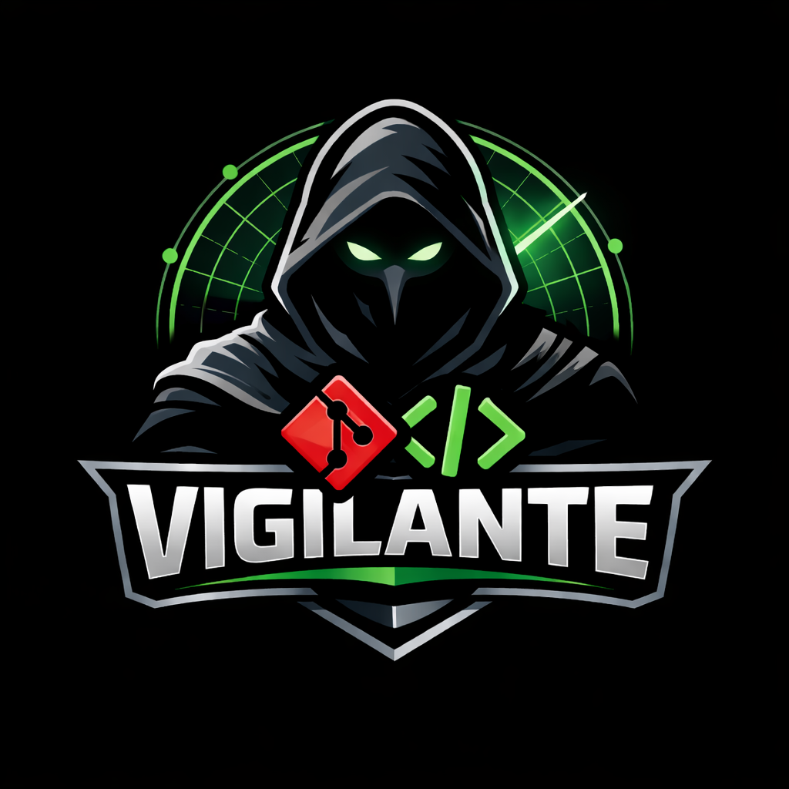

<p align="center">
  
</p>

# vigilante

[](https://github.com/aliengiraffe/vigilante/releases/latest)
[](https://goreportcard.com/report/github.com/nicobistolfi/vigilante)
[](https://pkg.go.dev/search?q=github.com%2Fnicobistolfi%2Fvigilante)
[](https://github.com/aliengiraffe/vigilante/blob/main/LICENSE)
[](https://github.com/aliengiraffe/vigilante/actions/workflows/release.yml)

`vigilante` is an extensible control plane for autonomous software delivery. It watches repositories, selects executable work items, prepares isolated implementation environments, dispatches headless coding agents, keeps project-management systems updated with progress, and maintains the delivery loop around pull requests.

It is a Go CLI and background service that runs locally on top of the tools teams already use: `git`, `gh`, and a supported coding-agent CLI such as `codex`, `claude`, or `gemini`. The current target platforms are macOS and Ubuntu.

Vigilante's architecture separates **project-management backends** (where work items come from) from **coding-agent providers** (what generates the code). GitHub is the first and currently only fully implemented backend; the abstraction layer is designed so additional backends such as Linear or Jira can be added without restructuring the core dispatch and session lifecycle.

Want to see that workflow on this repository? Browse [Vigilante's closed issues](https://github.com/aliengiraffe/vigilante/issues?q=is%3Aissue%20state%3Aclosed) for concrete examples of the project operating on its own codebase and improving itself over time.

## What Vigilante Is

`vigilante` is the orchestration layer around coding agents. It is responsible for:

- treating project-management work items (currently GitHub issues) as the work queue
- selecting eligible work based on labels, assignees, and repository limits
- creating dedicated git worktrees and issue branches for each session
- choosing the right execution playbook from repository classification
- launching supported coding-agent CLIs under a consistent lifecycle
- posting execution state back to the project-management backend through comments and PR tracking
- recovering, resuming, redispatching, and cleaning up local sessions safely

## What Vigilante Is Not

`vigilante` is not the code-generating model itself. Tools such as Codex, Claude Code, and Gemini are the execution engines that read prompts, edit code, run validation, and prepare pull requests. Keeping orchestration separate from code generation lets Vigilante stay provider-neutral and backend-neutral while owning scheduling, worktree isolation, project-management coordination, and PR maintenance.

## Why Use Vigilante

Vigilante turns a repository checkout into a controlled autonomous worker instead of a loose collection of scripts.

- The project-management backend (currently GitHub) stays the operator surface for issue intake, progress, resume commands, cleanup, and PR visibility.
- Each issue runs in an isolated worktree, which keeps the main checkout stable and makes unattended execution safer.
- Repository-aware skills let the same control plane adapt to standard repositories, monorepos, and supported build systems.
- Session state persists locally, so Vigilante can recover from failures, clean up stalled work, and avoid duplicate dispatch.
- Provider support is pluggable, so the orchestration layer remains stable even when teams change coding-agent runtimes.

## Quickstart

Install with Homebrew:

```sh
brew install vigilante
```

Prepare the local machine with your preferred coding-agent provider:

```sh
vigilante setup -d --provider codex
```

Register a repository after setup installs the background service:

```sh
vigilante watch ~/path/to/repo
```

Useful follow-up commands:

```sh
vigilante list
vigilante list --running
vigilante status
vigilante service restart
vigilante daemon run --once
```

Quickstart requirements:

- `git`
- `gh` authenticated against the GitHub account you want Vigilante to operate with
- one supported coding-agent CLI installed locally: `codex`, `claude`, or `gemini`

## Product Goal

Turn a local checkout into an autonomous coding-agent worker:

```sh
vigilante watch ~/hello-world-app
```

Once a folder is registered, `vigilante` should:

1. Resolve the repository path and detect the GitHub remote.
2. Poll or subscribe for open GitHub issues through `gh`.
3. Select issues that are ready to work and not already being handled.
4. Launch a headless coding agent session in YOLO mode against a dedicated git worktree.
5. Classify the watched repository and use the matching issue implementation skill from the repo `skills/` folder as part of the execution prompt.
6. Post progress comments back to the GitHub issue, including session start and failures.
7. Track watched repositories locally and optionally run as a daemon.

In the current implementation, that worker loop already covers repository onboarding, issue intake, isolated worktrees, provider orchestration, repo-aware execution skills, local session recovery, and part of the pull request maintenance path. CI/CD promotion and richer deployment control are planned next-stage capabilities.

Vigilante also monitors GitHub REST API quota through `gh api /rate_limit` before GitHub-heavy orchestration work. When the REST core bucket drops below `100` remaining requests, Vigilante posts one delay notice per affected issue for that reset window, pauses additional GitHub-backed work, and resumes automatically after GitHub's reported reset time.

## Architecture: Project-Management Backends

Vigilante separates the **project-management backend** (the system that hosts work items and comments) from the **coding-agent provider** (the CLI that generates code). The orchestration loop depends on a `Backend` interface (`internal/backend`) rather than calling GitHub APIs directly.

The `Backend` interface covers the minimum operations the dispatch loop needs:

- resolving assignees
- listing and fetching work items
- reading and posting comments
- detecting operator commands (`@vigilanteai resume`, `cleanup`, `recreate`)
- creating and closing work items

Optional capability interfaces extend the core for backends that support additional features:

| Capability | Description | GitHub |
|---|---|---|
| `LabelManager` | Sync labels on work items and projects | ✅ |
| `PullRequestManager` | Find, inspect, merge, and close pull requests | ✅ |
| `RateLimitChecker` | Expose API quota information for proactive throttling | ✅ |

GitHub is the only fully implemented backend today. Adding a new backend (e.g. Linear or Jira) requires implementing the `Backend` interface and registering it through `backend.Register()`. The orchestration loop checks capability interfaces at runtime so backends that do not support labels, PRs, or rate limits degrade gracefully.

Watch targets and sessions carry a `backend_id` field (defaulting to `"github"` for backward compatibility) so the system can route each target to the correct backend implementation.

## Telemetry

Vigilante emits anonymous telemetry with two different purposes:

- PostHog analytics events track product usage, such as command starts and completions, using bounded properties like command name, feature area, result, platform, and distro.
- OTLP logs remain the operational debugging stream when log export is configured.

Analytics events intentionally avoid raw repository contents, issue text, file paths, and other free-form command arguments. Operators can disable both streams with `DO_NOT_TRACK=1` or `MYTOOL_NO_ANALYTICS=1`.

## Core Workflow

For each watched repository:

1. Validate that the folder is a git repository.
2. Inspect `origin` and infer the GitHub repository slug.
3. Ensure required tools are available:
   - `git`
   - `gh`
   - the configured coding-agent provider CLI (`codex`, `claude`, or `gemini`)
4. Ensure the bundled issue implementation skills from the repo `skills/` folder are installed during setup, including companion agent metadata.
5. Query GitHub for open issues.
6. Determine which issues are eligible for execution.
7. Create a git worktree for the selected issue.
8. Launch a supported coding agent headlessly in the worktree with a prompt that:
   - uses the repo-aware issue implementation skill selected from repository classification
   - passes the detected repo/process context into the prompt
   - instructs the agent to comment on the issue when work starts
   - instructs the agent to keep commenting as progress is made
   - instructs the agent to preserve the user's git author, committer, and signing identity for any commit-related operation
   - instructs the agent not to add agent `Co-authored by:` trailers or similar commit attribution
   - instructs the agent to report errors back to the issue
9. Track the session state locally so the daemon does not duplicate work.
10. Clean up or mark terminal states when the session exits.

## Commands

`vigilante --help` and `vigilante -h` print top-level usage. Each command also supports command-specific help, for example:

```sh
vigilante watch --help
vigilante daemon run --help
```

### Shell completion

Generate a completion script for a supported shell and source or install it in your shell startup files:

```sh
vigilante completion bash
vigilante completion zsh
vigilante completion fish
```

Examples:

```sh
vigilante completion zsh > "${fpath[1]}/_vigilante"
autoload -Uz compinit && compinit
```

```sh
vigilante completion bash > ~/.local/share/bash-completion/completions/vigilante
```

```sh
vigilante completion fish > ~/.config/fish/completions/vigilante.fish
```

### Tool proxy commands

Vigilante can proxy a bounded set of external CLIs while emitting privacy-aware telemetry about only the tool and sanitized command shape:

- `vigilante gh ...`
- `vigilante git ...`
- `vigilante docker ...`

Examples:

```sh
vigilante gh repo view aliengiraffe/vigilante
vigilante git status --short
vigilante docker compose ps
```

The proxy preserves the underlying tool's stdout, stderr, and exit status. Telemetry intentionally avoids raw positional arguments, flag values, repo slugs, tokens, paths, prompts, and free-form text.

## Installation

Install `vigilante` with Homebrew:

```sh
brew install vigilante
```

Upgrade later with:

```sh
brew upgrade vigilante
```

### `vigilante watch [--assignee <value>] [--max-parallel <value>] [--provider <codex|claude|gemini>] [--branch <name> | --track-default-branch] <path>`

Register a local repository for issue monitoring.

Expected behavior:

- expands `~` and resolves the absolute path
- validates the folder is a git repository
- discovers the GitHub remote from git config
- defaults new watch targets to tracking the repository's current default branch automatically
- pins the base branch when `--branch <name>` is supplied
- switches an existing target back to default-branch tracking when `--track-default-branch` is supplied
- defaults the assignee filter to `me` unless overridden
- defaults `--max-parallel` to `0` when not configured, where `0` means unlimited
- defaults `--provider` to `codex` unless overridden
- resolves `me` to the authenticated GitHub login at runtime before issue queries
- preserves an existing target's branch mode unless one of the branch flags is supplied
- stores the target in `~/.vigilante/watchlist.json`

Example:

```sh
vigilante watch ~/hello-world-app
```

```sh
vigilante watch --assignee nicobistolfi ~/hello-world-app
```

```sh
vigilante watch --max-parallel 3 ~/hello-world-app
```

```sh
vigilante watch --max-parallel 0 ~/hello-world-app
```

```sh
vigilante watch --provider claude ~/hello-world-app
```

```sh
vigilante watch --provider gemini ~/hello-world-app
```

```sh
vigilante watch --branch develop ~/hello-world-app
```

```sh
vigilante watch --track-default-branch ~/hello-world-app
```

### `vigilante list`

Show the currently watched repositories and their metadata.

Expected fields:

- local path
- GitHub repository slug
- max parallel issue sessions
- daemon status
- last scan time
- active issue/session, if any
- effective base branch and whether it is `auto` or `pinned`

### `vigilante list --running`

Show currently running sessions with their repository, issue number, branch, and worktree path.

### `vigilante status`

Show a compact operational overview of the Vigilante OS-managed user service, watched repositories, sessions, and GitHub rate limits.

Expected behavior:

- reports a stable `state` value of `running`, `stopped`, or `not-installed`
- includes the service manager, service identifier, and installed service file path
- includes a watched-repositories summary with key per-repo metadata such as repo slug, branch plus branch mode, provider, filters or limits, activity, and last scan time
- exits successfully when the service is not installed so operators and scripts can inspect the reported state
- fails with a clear error on unsupported operating systems or when the underlying service manager cannot be queried

### `vigilante logs [--access] [--repo <owner/name>] [--issue <n>]`

Inspect local log files under `~/.vigilante/logs/`.

Expected behavior:

- `vigilante logs` lists the available daemon, access, and per-issue session logs so an operator can see which local evidence exists before choosing a recovery action
- `vigilante logs --access` prints the structured access log at `~/.vigilante/logs/access.jsonl`, where each JSON line records one subprocess execution with timing, execution context, repo or issue metadata when available, sanitized argv, and exit status
- `vigilante logs --repo <owner/name> --issue <n>` prints the log for one issue session so an operator can inspect the latest local execution details directly
- logs complement `vigilante list`, `vigilante status`, and GitHub issue comments; they do not replace session state or the remote audit trail

### `vigilante service restart`

Restart the installed Vigilante user service through the operating system service manager.

Expected behavior:

- uses `launchctl` on macOS and `systemctl --user` on Linux
- restarts the installed managed service instead of launching an unmanaged background process
- fails clearly when the service is not installed or the platform is unsupported

### `vigilante cleanup --repo <owner/name> [--issue <n>]`

Clean up running sessions without touching unrelated historical session records.

Expected behavior:

- `--repo <owner/name> --issue <n>` cleans up one running session for a single issue
- `--repo <owner/name>` cleans up all running sessions for one repository
- removes the running-session blockage from local state
- removes the local worktree and issue branch when those artifacts are present and safe to delete

### `vigilante cleanup --all`

Clean up all running sessions across all watched repositories.

### `vigilante redispatch --repo <owner/name> --issue <n>`

Force a fresh local restart for one watched issue.

Expected behavior:

- fails clearly when the target repository is not currently watched
- stops any active local session for the target issue before redispatching
- removes the target issue worktree and local issue branch artifacts when safe to do so
- clears stale local session state for the target issue only
- immediately launches a brand-new implementation session using the current watched-repo configuration
- does not delete remote pull requests or remote branches

### `vigilante unwatch <path>`

Remove a repository from the watchlist without deleting the repository itself.

### `vigilante daemon run`

Run the long-lived watcher loop in the foreground. This is the process the OS service should execute.
By default it scans watched repositories every 1 minute. Use `--interval` to override that cadence for manual runs.

### `vigilante setup [--provider <codex|claude|gemini>]`

Prepare the machine for autonomous execution.

Expected behavior:

- creates `~/.vigilante/`
- initializes `watchlist.json`
- verifies `git`, `gh`, and the selected coding-agent provider CLI
- verifies the selected provider CLI reports a compatible build-supported version range, currently `>=0.114.0, <2.0.0` for `codex`, `>=2.0.0, <3.0.0` for `claude`, and `>=1.0.0, <2.0.0` for `gemini`
- installs the bundled coding-agent skills for regular runtime use, including any companion files under each skill directory
  - `vigilante-issue-implementation`
  - `vigilante-issue-implementation-on-monorepo`
  - `vigilante-issue-implementation-on-turborepo`
  - `vigilante-issue-implementation-on-nx`
  - `vigilante-issue-implementation-on-rush`
  - `vigilante-issue-implementation-on-rush-monorepo`
  - `vigilante-issue-implementation-on-bazel`
  - `vigilante-issue-implementation-on-gradle`
  - `vigilante-issue-implementation-on-bazel-monorepo`
  - `vigilante-conflict-resolution`
  - `vigilante-create-issue`
  - `vigilante-local-service-dependencies`
  - `docker-compose-launch`
- installs or updates the daemon definition

On macOS, `vigilante setup` resolves Homebrew-style symlinks before it prepares the daemon binary. For Homebrew cask installs, Vigilante first clears `com.apple.provenance` and `com.apple.quarantine` recursively from the enclosing Caskroom version directory, then removes those same xattrs from the resolved binary when present, ad-hoc signs that binary, and runs `spctl --assess --type execute -vv` against the resolved path before loading the service.

If Gatekeeper still rejects the binary, the error now reports both the assessed path and the invoked path when they differ. A useful manual recovery sequence is:

```sh
realbin="$(python3 -c 'import os, sys; print(os.path.realpath(sys.argv[1]))' /opt/homebrew/bin/vigilante)"
xattr "$realbin"
xattr -dr com.apple.provenance "$(dirname "$realbin")" 2>/dev/null || true
xattr -dr com.apple.quarantine "$(dirname "$realbin")" 2>/dev/null || true
xattr -d com.apple.provenance "$realbin" 2>/dev/null || true
xattr -d com.apple.quarantine "$realbin" 2>/dev/null || true
codesign --force --sign - "$realbin"
spctl --assess --type execute -vv "$realbin"
```

## Development Mode

For fast local iteration, prefer running `vigilante` in the foreground instead of going through the installed OS service on every change.

If you use [`go-task`](https://taskfile.dev/), the repository includes a root `Taskfile.yml` for the main local workflows. Install `task` with either:

```sh
brew install go-task/tap/go-task
```

or:

```sh
go install github.com/go-task/task/v3/cmd/task@latest
```

Primary tasks:

- `task test` runs `go test ./...`
- `task build` builds `./vigilante`
- `task install` copies the built binary to `~/.local/bin/vigilante`
- `task setup` runs `./vigilante setup`
- `task install-setup` runs `~/.local/bin/vigilante setup`
- `task setup-daemon` runs a small wrapper around `~/.local/bin/vigilante setup` that retries once on macOS after cleaning up an existing `launchd` agent

Recommended loop:

```sh
task test
task build
task setup
./vigilante watch /path/to/repo
./vigilante daemon run --once
```

Useful development commands:

- run a single scan without installing the daemon:

```sh
go run ./cmd/vigilante daemon run --once
```

- run the foreground daemon loop directly from source:

```sh
go run ./cmd/vigilante daemon run --interval 30s
```

- rebuild the installed binary and refresh the installed provider skills:

```sh
task install
task install-setup
```

- reinstall the OS service after changing daemon or service behavior:

```sh
task setup-daemon
```

On macOS, `task setup-daemon` now performs one explicit recovery attempt when an existing `com.vigilante.agent` launch agent is already present. If the first refresh fails, the task cleans up the existing launch agent, retries once, and prints a short manual `launchctl bootout ...` hint if recovery still fails.

On macOS, `vigilante setup` also prepares the installed daemon binary before reloading the LaunchAgent by clearing observed Gatekeeper xattrs from the Homebrew cask install root when applicable, clearing those xattrs from the resolved binary, applying ad-hoc signing, and validating the binary with `spctl`. If macOS still rejects the binary, setup exits with a code-signing error instead of leaving the agent stuck in `OS_REASON_CODESIGNING`.

Notes:

- foreground runs are the quickest way to iterate on scheduler, worktree, and coding-agent execution behavior
- when `vigilante` runs from a repository checkout, `setup` refreshes installed skills from the local repo `skills/` folder so skill edits are picked up immediately
- when `vigilante` runs as an installed binary outside the repo checkout, `setup` uses skills embedded in the binary so it works from any directory without depending on the source tree
- after changing service installation logic on macOS, rerun `setup` so the `launchd` plist is regenerated with the current shell-derived PATH
- the CLI entrypoint lives in `cmd/vigilante/`, while non-exported implementation packages live under `internal/`

## CI and Releases

Pull requests are validated in GitHub Actions with native Go commands:

- `gofmt -l .`
- `go vet ./...`
- `go test ./...`
- `go build ./...`
- `goreleaser check`

Tagged releases are built and published with GoReleaser. Pushing a version tag that matches `{x}.{y}.{z}` and points to a commit already reachable from `main` creates a GitHub Release with:

- `darwin/amd64`
- `darwin/arm64`
- `linux/amd64`
- a `checksums.txt` file for the published archives
- an updated Homebrew formula in `homebrew/core` so `brew install vigilante` installs the tagged release

The release workflow requires a GitHub App that can write to the tap repository:

- `APP_ID`: the GitHub App ID
- `APP_PRIVATE_KEY`: the GitHub App private key

During a tagged release, GitHub Actions exchanges those secrets for a short-lived token scoped to `aliengiraffe/homebrew-spaceship` and passes it to GoReleaser as `HOMEBREW_GITHUB_API_TOKEN`.

Pushes to `main` also publish a rolling prerelease channel without requiring GoReleaser Pro. The nightly workflow builds OSS snapshot archives, recreates the `main-nightly` GitHub prerelease with fresh assets, and updates a separate Homebrew cask in `aliengiraffe/homebrew-spaceship`.

Nightly install path:

```sh
brew tap aliengiraffe/spaceship
brew install vigilante-nightly
```

Stable installs remain on the tagged release path:

```sh
brew install vigilante
```

Recommended release flow:

```sh
git checkout main
git pull --ff-only
git tag 1.2.3
git push origin 1.2.3
```

Tags that do not match the required version format, such as `v1.2.3` or `release-1.2.3`, may start the release workflow but are rejected by the tag validation step before GoReleaser publishes artifacts. The release workflow also validates that the tagged commit is already merged into `main` before publishing to GitHub Releases.

Before cutting a release, validate the packaging config locally with:

```sh
goreleaser check
```

You can also confirm the Homebrew cask will target the published release archive names by checking the GoReleaser archive template:

- `vigilante_<version>_macOS_amd64.tar.gz`
- `vigilante_<version>_macOS_arm64.tar.gz`
- `vigilante_<version>_Linux_amd64.tar.gz`

## Local State

`vigilante` should maintain its local state under:

```text
~/.vigilante/
```

Initial files:

- `config.json`: service-level daemon configuration
- `watchlist.json`: configured repositories being monitored
- `sessions.json`: active or recent issue execution sessions
- `logs/`: daemon and run logs

Suggested `config.json` shape:

```json
{
  "blocked_session_inactivity_timeout": "20m"
}
```

Notes:

- `blocked_session_inactivity_timeout` is a service-level setting shared across all watched repositories.
- The default is `20m`.
- A blocked session is eligible for automatic local cleanup only after there have been no qualifying user comments on the issue, no session updates, and no worktree updates for longer than the configured timeout.
- This inactivity cleanup is conservative: it clears local blocked-session artifacts so the issue can be redispatched later, but it does not delete remote pull requests or remote branches automatically.
- Stale running implementation sessions use a separate recovery path: after Vigilante first confirms the run is stale, it waits 20 minutes before attempting an automatic fresh restart, persists the restart attempt count in session state, and stops after 3 automatic restarts until a human intervenes.
- When an issue looks blocked or the daemon appears unhealthy, inspect `vigilante logs` alongside `sessions.json`, `vigilante list`, `vigilante status`, and GitHub issue comments so recovery decisions use both local state and remote context.

### Operator Log Triage

Use logs to decide which recovery command fits the evidence already recorded locally.

1. Run `vigilante list --running` or `vigilante status` first to confirm whether the problem is scoped to one issue or the daemon as a whole.
2. Run `vigilante logs` with no flags when the daemon is stalled, scans are not happening, multiple repositories look affected, or you need to identify the relevant local log file quickly.
3. Run `vigilante logs --repo <owner/name> --issue <n>` when one issue is blocked, a resume attempt failed, or you need to inspect the latest session-specific failure before deciding what to do next.
4. If the per-issue log shows the agent can continue from the existing worktree and session state, prefer `vigilante resume --repo <owner/name> --issue <n>`.
5. If the per-issue log shows corrupted local state, a dead worktree, or a failed run that should be restarted cleanly, use `vigilante redispatch --repo <owner/name> --issue <n>`.
6. If the log shows the local session artifacts are stale and should be removed without starting new work immediately, use `vigilante cleanup --repo <owner/name> --issue <n>` or repo-wide cleanup as appropriate.
7. If the daemon log points to service-manager failures, scan-loop problems, or machine-level issues, troubleshoot the daemon with `vigilante service restart`, `vigilante setup`, or a foreground `vigilante daemon run --once` check before touching issue sessions.

Suggested `watchlist.json` shape:

```json
[
  {
    "path": "/Users/example/hello-world-app",
    "repo": "owner/hello-world-app",
    "branch_mode": "auto",
    "branch": "main",
    "assignee": "me",
    "max_parallel_sessions": 0,
    "last_scan_at": "2026-03-10T12:00:00Z"
  }
]
```

## Issue Selection Rules

The scheduler should stay conservative in the first version.

Initial rules:

- only consider open issues
- ignore pull requests
- enforce positive `max_parallel_sessions` independently for each watched repository
- treat `max_parallel_sessions: 0` as unlimited parallel issue dispatch for that repository
- count both running implementation sessions and open-PR maintenance sessions against that repository limit
- avoid duplicate work across multiple daemon scans
- allow an issue label that exactly matches a registered provider id, such as `codex`, `claude`, or `gemini`, to override the watch target provider for that issue only
- if more than one provider-id label is present on the same issue, skip dispatch instead of choosing a provider arbitrarily
- prefer oldest eligible open issue first unless later prioritization rules are added

Future policy can expand to richer label filters, assignment rules, and priority queues.

## Pull Request Maintenance

For pull requests tied to an active Vigilante session:

- keep the branch updated against the session or pull request base branch through the existing maintenance loop instead of assuming `main`
- if either the source issue or the PR has `vigilante:automerge`, attempt a GitHub squash merge only after required checks pass and GitHub reports the PR is mergeable
- keep the legacy plain `automerge` PR label working as a compatibility alias during migration to the namespaced label
- never force through branch protection, required reviews, or failing checks

## Issue Labeling System

Vigilante should use a small issue-label taxonomy that complements issue comments instead of replacing them. The repository-owned proposal lives in [`.github/labels.json`](.github/labels.json).

Label ownership rules:

- Work-classification labels such as `bug`, `feature`, and `good first issue` remain repository-managed and should not be changed by Vigilante.
- `vigilante:*` lifecycle and intervention labels are primarily informational and should be set or cleared by Vigilante as the issue moves through execution.
- Provider-routing labels `codex`, `claude`, and `gemini` keep their existing control semantics and remain human-managed overrides.
- `vigilante:resume` is the preferred control label for unblocking a paused session; `resume` remains a legacy-compatible alias.

Proposed groups:

- Execution state: `vigilante:queued`, `vigilante:running`, `vigilante:blocked`, `vigilante:ready-for-review`, `vigilante:awaiting-user-validation`, `vigilante:done`
- Human-intervention state: `vigilante:needs-human-input`, `vigilante:needs-provider-fix`, `vigilante:needs-git-fix`
- Provider routing controls: `codex`, `claude`, `gemini`
- Explicit control labels: `vigilante:resume` and legacy `resume`

Recommended lifecycle:

1. When an issue becomes eligible but has not started, add `vigilante:queued`.
2. When execution starts, replace `vigilante:queued` with `vigilante:running`.
3. If execution stalls on a known blocker, replace `vigilante:running` with `vigilante:blocked` and add exactly one matching `vigilante:needs-*` label when possible.
4. When implementation is ready for a human to inspect, replace blocked or running state with `vigilante:ready-for-review` as the single review-handoff label.
5. When code review is complete but a product or operator check is still required, use `vigilante:awaiting-user-validation`.
6. When the issue reaches a terminal successful state, clear transient labels and leave `vigilante:done`.

This keeps control semantics narrow while making the issue list readable at a glance. Existing label-based behaviors stay compatible: watch-target allowlists still match repository-managed labels, provider overrides still use provider ids, and blocked-session recovery still honors both `resume` and `vigilante:resume`.

## Headless Agent Execution Contract

When `vigilante` launches a coding agent for an issue, it should:

- create a dedicated git worktree for that issue
- pass a prompt that includes the repository, issue number, and local working directory
- ensure the issue implementation skill is available
- instruct the agent to post a GitHub comment when the session starts
- instruct the agent to post progress comments during execution
- instruct the agent to preserve the user's existing git identity and signing configuration for commits, amends, rebases, and other history edits
- instruct the agent not to add coding-agent `Co-authored by:` trailers or similar attribution
- instruct the agent to report failures on the issue if execution aborts

The agent invocation remains a subprocess wrapper around an installed coding CLI such as `codex`, `claude`, or `gemini`, while keeping the orchestration behavior provider-neutral.

## GitHub Integration

GitHub access should use `gh` rather than direct API client dependencies.

Expected `gh` responsibilities:

- detect authentication state
- list open issues for a repository
- post start/progress/error comments
- optionally inspect issue metadata needed for scheduling

This keeps the Go code smaller and delegates auth/session handling to the installed GitHub CLI.

## Worktree Strategy

Each issue run should get an isolated worktree to prevent branch collisions and dirty working trees.

Suggested naming:

- branch: `vigilante/issue-<number>-<title-slug>` with fallback compatibility for legacy `vigilante/issue-<number>` branches
- worktree path: a repo-local path such as `<repo>/.worktrees/vigilante/issue-<number>`

The daemon must track which worktrees are active so duplicate launches do not happen.

## Daemon and Service Installation

Initial supported operating systems:

- macOS via `launchd`
- Ubuntu via `systemd --user`

Service responsibilities:

- start `vigilante daemon run`
- restart on failure
- read the persisted watchlist
- write logs to `~/.vigilante/logs/`

## Error Handling

Failures should be visible both locally and on GitHub.

Minimum error reporting behavior:

- write structured local logs
- mark the local session as failed
- comment on the GitHub issue when the coding-agent session fails to start
- comment on the GitHub issue when a running session exits with error

## Development Plan

The initial implementation should be split into issues covering:

1. CLI scaffolding and config/state management
2. Git repository and GitHub remote discovery
3. GitHub issue polling through `gh`
4. Coding-agent skill installation and prompt assembly
5. Worktree lifecycle management
6. Headless coding-agent session runner with GitHub progress comments
7. Daemon loop and scheduler
8. macOS and Ubuntu service installation

## Current Status

The repository currently contains the initial Go module and a placeholder CLI. The feature set described above is the target specification that should now be implemented incrementally through GitHub issues.
