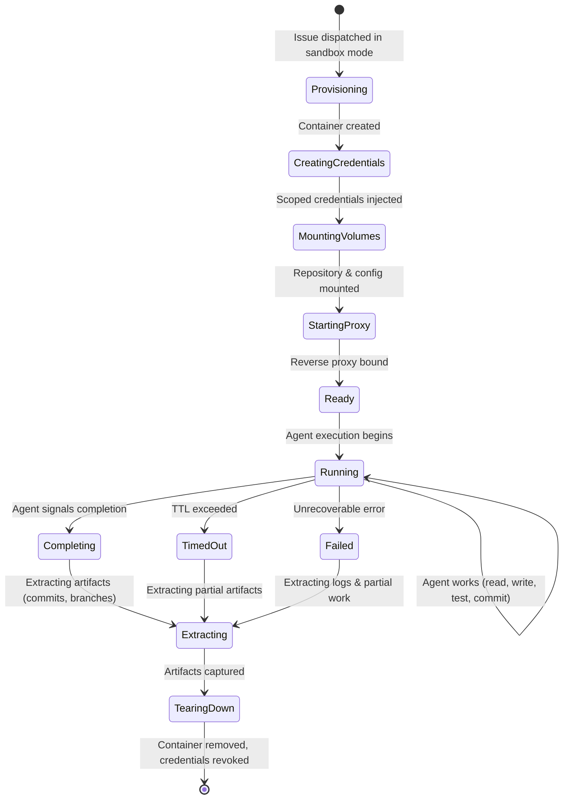
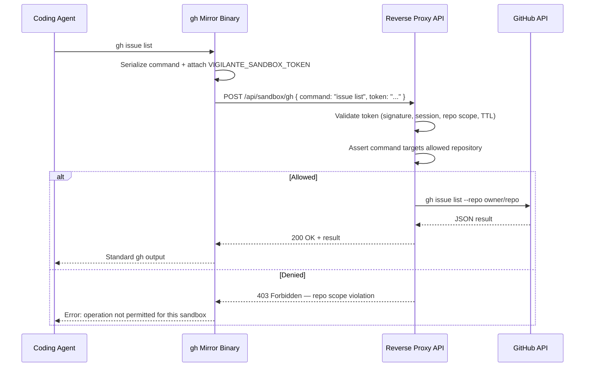

# Sandbox

Sandbox is a security feature that runs coding agents inside isolated Docker containers on your local machine. Instead of giving agents direct access to the host environment, Vigilante uses the Docker API or a compatible container runtime API to spin up locked-down execution environments where agents can work on a repository without reaching anything else.

## Why Sandbox Exists

Coding agents need broad tool access to be effective — they read files, run tests, install packages, spin up services, and interact with GitHub. That breadth of access creates risk when the agent runs directly on the host. A misconfigured or misbehaving agent could read credentials, access unrelated repositories, or interact with services it was never intended to touch.

Sandbox draws a hard boundary. The agent operates inside a container that has everything it needs to do its job and nothing it does not.

## Architecture Overview

```mermaid
graph TB
    subgraph Host["Host Machine"]
        V[Vigilante Daemon]
        D[Docker / Container Runtime API]
        GH[gh CLI — Host Identity]
        RP[Reverse Proxy API]

        V -->|"provisions via API"| D
        V -->|"starts"| RP
        RP -->|"scoped execution"| GH
    end

    subgraph Sandbox["Sandbox Container"]
        A[Coding Agent — Claude Code / Codex / Gemini CLI]
        GHM[gh Mirror Binary]
        REPO[Mounted Repository]
        DIND[Docker-in-Docker]

        A -->|"reads/writes"| REPO
        A -->|"gh commands"| GHM
        A -->|"docker compose up"| DIND
    end

    D -->|"creates & manages"| Sandbox
    GHM -->|"forwards over HTTP"| RP
    V -->|"injects scoped credentials"| Sandbox

    style Sandbox fill:#1a1a2e,stroke:#e94560,stroke-width:2px
    style Host fill:#0f3460,stroke:#16213e,stroke-width:2px
```



## How It Works

When Vigilante dispatches an issue in sandbox mode, it provisions a Docker container through the Docker API or a compatible runtime. The container is purpose-built for coding-agent execution:

- **Pre-installed coding agents.** Codex, Claude Code, and Gemini CLI are available inside the container. The selected provider runs the same way it would on the host.
- **Volume sync at spinoff.** Vigilante mounts the repository code and each agent's configuration into the container at creation time. The agent starts with the same settings, credentials, and codebase state it would have locally.
- **Docker-in-Docker.** The container includes DinD capability, so the coding agent can spin up additional containers for databases, caches, message brokers, and other services required during implementation. Service dependencies stay inside the sandbox boundary.

## Container Lifecycle



### Phase Details

| Phase | Description |
|-------|-------------|
| **Provisioning** | Vigilante calls the Docker API to create the container from the sandbox base image. Network, resource limits, and DinD capability are configured at this stage. |
| **Creating Credentials** | Scoped, short-lived credentials are generated and injected into the container as environment variables. See [Credential Provisioning](#credential-provisioning). |
| **Mounting Volumes** | The target repository worktree and agent configuration directories are bind-mounted into the container. |
| **Starting Proxy** | The reverse proxy API starts listening on a host port mapped into the container. The `gh` mirror binary inside the sandbox is configured to target this endpoint. |
| **Ready / Running** | The coding agent launches and works normally. All `gh` calls are intercepted by the reverse proxy. |
| **Extracting** | Before teardown, Vigilante extracts commits, branch state, and execution logs from the container. |
| **Tearing Down** | The container is stopped and removed. Scoped credentials are revoked. Temporary volumes are deleted. |

## Credential Provisioning

Sandbox credentials are scoped, short-lived, and single-purpose. The host never shares its own tokens or keys with the container directly. Instead, Vigilante mints constrained credentials at provision time and revokes them at teardown.

### Credential Creation Sequence

```mermaid
sequenceDiagram
    participant V as Vigilante Daemon
    participant D as Docker API
    participant C as Sandbox Container
    participant RP as Reverse Proxy API
    participant GH as GitHub API

    Note over V: Issue dispatched in sandbox mode

    V->>V: Generate unique session ID
    V->>V: Derive scoped credential set for session

    rect rgb(40, 40, 80)
        Note over V,GH: Credential Minting
        V->>V: Create sandbox API token (HMAC-signed, embeds session ID + repo scope + TTL)
        V->>V: Generate ephemeral SSH keypair for git push/pull
        V->>GH: Register ephemeral deploy key (write access, single repo)
        GH-->>V: Deploy key ID (for later revocation)
    end

    V->>D: Create container with env vars + mounted credential files
    D-->>V: Container ID

    rect rgb(40, 80, 40)
        Note over V,C: Credential Injection
        V->>C: VIGILANTE_SESSION_ID (env var)
        V->>C: VIGILANTE_SANDBOX_TOKEN (env var — scoped API token)
        V->>C: VIGILANTE_PROXY_URL (env var — reverse proxy endpoint)
        V->>C: SSH private key (mounted read-only at /etc/vigilante/ssh/)
        V->>C: Git config pointing SSH to ephemeral key
    end

    V->>RP: Register session (session ID, allowed repo, TTL)
    V->>D: Start container
    D-->>C: Container starts

    Note over C: Agent launches with scoped credentials
    C->>RP: gh pr list (via mirror binary, sends VIGILANTE_SANDBOX_TOKEN)
    RP->>RP: Validate token signature, check repo scope, check TTL
    RP->>GH: Execute gh pr list --repo <allowed-repo>
    GH-->>RP: Result
    RP-->>C: Result
```



### Credential Types

| Credential | Scope | Lifetime | Storage in Container |
|------------|-------|----------|---------------------|
| **Sandbox API Token** | Single session + single repository. HMAC-signed JWT embedding the session ID, target `owner/repo`, and an expiry timestamp. | Matches container TTL (default: 2 hours). | `VIGILANTE_SANDBOX_TOKEN` environment variable. |
| **Ephemeral SSH Key** | Registered as a GitHub deploy key on the target repository with write access. | Revoked at teardown. | Read-only mount at `/etc/vigilante/ssh/id_ed25519`. Git config inside the container points `core.sshCommand` to this key. |
| **Proxy URL** | The host endpoint the `gh` mirror binary targets. Bound to `127.0.0.1` on a per-session port. | Proxy process terminates at teardown. | `VIGILANTE_PROXY_URL` environment variable. |

### Token Validation

Every request from the `gh` mirror binary to the reverse proxy carries the `VIGILANTE_SANDBOX_TOKEN`. The proxy validates:

1. **Signature** — The HMAC signature is verified against the daemon's signing key. Tampered or forged tokens are rejected.
2. **Session ID** — The embedded session ID must match a currently active sandbox session.
3. **Repository scope** — The target repository in the request must match the repository encoded in the token. Cross-repo requests are rejected.
4. **TTL** — The token's expiry timestamp must be in the future. Expired tokens are rejected even if the container is still running.

If any check fails, the proxy returns an error to the `gh` mirror binary, which surfaces it to the agent as a standard `gh` CLI error.

## GitHub CLI Reverse Proxy

The most important security mechanism in sandbox mode is how GitHub access works inside the container.

The host machine's `gh` CLI is not mapped into the sandbox. Instead, the container receives a `gh` binary that acts as a mirror, forwarding CLI commands to a Vigilante API running on the host. That API enforces repository-scoped access control before executing anything.



What this means in practice:

- The coding agent uses `gh` normally inside the container. From the agent's perspective, the CLI behaves as expected.
- The Vigilante API intercepts every command and only permits operations against the specific repository the agent is working on.
- Issue listing, PR creation, comment posting, and code browsing are all scoped to the assigned repository.
- Requests targeting any other repository are rejected, regardless of what the host `gh` CLI has access to.

This reverse-proxy design ensures that even if the host GitHub identity has organization-wide or cross-repository access, the sandboxed agent cannot see issues, pull requests, or code from repositories outside its assignment.

## Vigilante Sandbox API

The daemon exposes internal API endpoints for sandbox orchestration. These are called by the Vigilante daemon itself during dispatch and by the reverse proxy during agent execution.

### Provisioning Endpoints

#### `POST /api/sandbox/provision`

Creates a new sandbox session. Called by the daemon when dispatching an issue in sandbox mode.

**Request:**

```json
{
  "repository": "owner/repo",
  "issue_number": 42,
  "provider": "claude-code",
  "ttl_seconds": 7200,
  "resource_limits": {
    "memory": "8g",
    "cpus": 4,
    "disk": "20g"
  }
}
```

**Response:**

```json
{
  "session_id": "sbx_a1b2c3d4e5f6",
  "container_id": "sha256:abc123...",
  "sandbox_token": "eyJhbGciOi...",
  "proxy_port": 9821,
  "ssh_public_key": "ssh-ed25519 AAAA...",
  "deploy_key_id": 98765432,
  "expires_at": "2026-04-06T16:00:00Z",
  "status": "provisioning"
}
```

#### `GET /api/sandbox/sessions/:session_id`

Returns the current state of a sandbox session.

**Response:**

```json
{
  "session_id": "sbx_a1b2c3d4e5f6",
  "repository": "owner/repo",
  "issue_number": 42,
  "provider": "claude-code",
  "status": "running",
  "created_at": "2026-04-06T14:00:00Z",
  "expires_at": "2026-04-06T16:00:00Z",
  "container_id": "sha256:abc123...",
  "resource_usage": {
    "memory_mb": 2048,
    "cpu_percent": 35.2
  }
}
```

#### `POST /api/sandbox/sessions/:session_id/teardown`

Initiates graceful teardown of a sandbox session. See [Teardown](#environment-teardown).

**Request:**

```json
{
  "reason": "completed",
  "extract_artifacts": true
}
```

### Reverse Proxy Endpoints

#### `POST /api/sandbox/gh`

Proxied `gh` CLI execution. Called by the `gh` mirror binary inside the container.

**Request:**

```json
{
  "command": "pr create --title 'Fix issue' --body '...'",
  "token": "eyJhbGciOi..."
}
```

**Response (success):**

```json
{
  "exit_code": 0,
  "stdout": "https://github.com/owner/repo/pull/43\n",
  "stderr": ""
}
```

**Response (scope violation):**

```json
{
  "exit_code": 1,
  "stdout": "",
  "stderr": "sandbox: operation denied — target repository 'other/repo' is outside session scope"
}
```

#### `POST /api/sandbox/token/refresh`

Extends the TTL of a sandbox token when the daemon determines additional time is needed. Only callable by the daemon, not from inside the container.

**Request:**

```json
{
  "session_id": "sbx_a1b2c3d4e5f6",
  "extend_seconds": 3600
}
```

## Environment Teardown

Sandboxes are designed to be ephemeral. Every sandbox has a maximum TTL, and teardown is guaranteed whether the agent completes successfully, fails, or times out.

### Teardown Sequence

```mermaid
sequenceDiagram
    participant V as Vigilante Daemon
    participant D as Docker API
    participant C as Sandbox Container
    participant RP as Reverse Proxy API
    participant GH as GitHub API

    Note over V: Teardown triggered (completion, timeout, or failure)

    rect rgb(80, 60, 20)
        Note over V,C: Artifact Extraction
        V->>D: docker exec: git log, git diff, git branch
        D-->>V: Commits, branch state, uncommitted changes
        V->>D: docker cp: extract execution logs
        D-->>V: Agent logs + build output
        V->>V: Store artifacts for post-mortem / PR creation
    end

    rect rgb(80, 40, 40)
        Note over V,GH: Credential Revocation
        V->>RP: Deregister session (invalidate token immediately)
        RP-->>V: Session removed from active set
        V->>GH: Delete deploy key (deploy_key_id)
        GH-->>V: Deploy key removed
        V->>V: Destroy signing material for session token
    end

    rect rgb(60, 40, 60)
        Note over V,D: Container Removal
        V->>D: docker stop (graceful, 10s timeout)
        D->>C: SIGTERM
        C-->>D: Exit
        V->>D: docker rm --volumes
        D-->>V: Container and anonymous volumes removed
    end

    Note over V: Session record updated to "terminated"
```



### Teardown Triggers

| Trigger | Behavior |
|---------|----------|
| **Agent completes** | The agent exits with a success signal. Vigilante extracts artifacts and begins orderly teardown. |
| **TTL exceeded** | The sandbox token expires. The reverse proxy begins rejecting requests. The daemon initiates teardown with a 60-second grace period for the agent to wrap up. |
| **Unrecoverable failure** | The agent crashes or the container enters an unhealthy state. The daemon extracts whatever artifacts are available and tears down immediately. |
| **Manual cancellation** | The operator cancels the session via CLI or API. Treated the same as TTL exceeded — grace period, then teardown. |
| **Daemon shutdown** | If the Vigilante daemon itself is shutting down, all active sandboxes receive graceful teardown in parallel. |

### Cleanup Guarantees

Teardown is implemented as a checklist where each step is idempotent and retried on failure:

1. **Token invalidation** — The sandbox token is removed from the reverse proxy's active session set. Even if subsequent steps fail, the container can no longer make authenticated requests.
2. **Deploy key revocation** — The ephemeral SSH deploy key is deleted from the GitHub repository. If the GitHub API is unreachable, revocation is queued for retry.
3. **Container stop** — `SIGTERM` with a 10-second grace period, followed by `SIGKILL` if needed.
4. **Container removal** — The container and its anonymous volumes are removed. Named volumes (if any) are left for explicit operator cleanup.
5. **Proxy shutdown** — The per-session reverse proxy listener is closed and the port is released.
6. **Session record finalization** — The session is marked as `terminated` with a reason, duration, and links to extracted artifacts.

If the host is interrupted (power loss, crash) before teardown completes, the daemon runs a **stale session reconciler** on startup that detects orphaned containers and credentials and cleans them up.

## Security Model

What agents **can** do inside the sandbox:

- Read and modify the assigned repository codebase.
- Run the repository's build, test, and lint toolchains.
- Use Docker to start local service dependencies such as databases or caches.
- View issues and pull requests for the assigned repository.
- Post comments and push commits to the assigned repository.
- Use their own agent configuration and installed tools.

What agents **cannot** do:

- Access files, credentials, or processes on the host machine outside the mounted codebase.
- View or interact with issues, pull requests, or code from any other repository.
- Use the host `gh` CLI identity to perform operations beyond the assigned repository scope.
- Reach network services on the host or local network unless explicitly configured.
- Escape the container boundary to affect the host environment.
- Refresh or extend their own credential TTL.
- Survive beyond the maximum session TTL.

## Why It Matters

Sandbox mode lets Vigilante run coding agents with full tool access while keeping the blast radius of any single session limited to exactly one repository. The agent gets the environment it needs to be productive. The operator gets confidence that autonomous execution cannot leak across repository boundaries, access unrelated credentials, or interact with infrastructure it was never assigned to.
